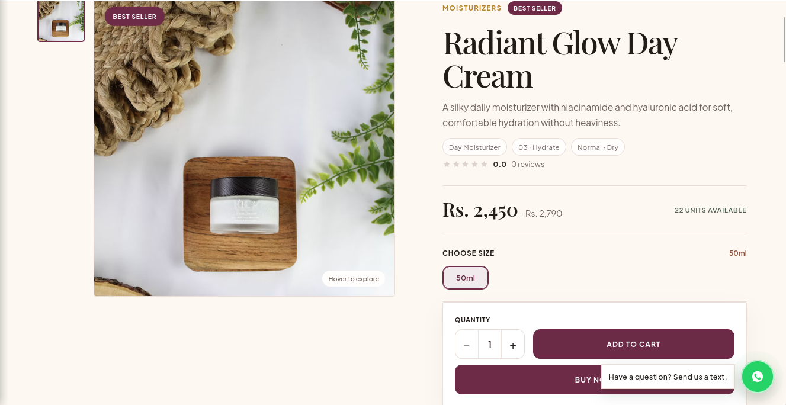
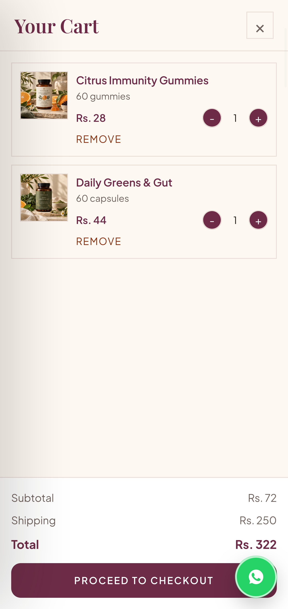

# Glow Beauty Ecommerce CMS Lite

A free, reusable **Node.js ecommerce CMS starter** for beauty, skincare and cosmetic stores.

Built with **Node.js, Express, EJS and MongoDB**.

## Screenshots

### Storefront


### Products


### Product Details


### Mobile Storefront


### Mobile Cart


## Features

- Admin login and setup
- Product add/edit/delete
- Categories
- Product image uploads
- Basic stock management
- Responsive storefront
- Product search and filtering
- Shopping cart
- Guest checkout
- Cash on Delivery / manual orders
- Order management
- Order status updates
- Automatic stock handling
- Basic SEO meta tags

## Tech Stack

**Node.js · Express.js · MongoDB · Mongoose · EJS · HTML · CSS · JavaScript**

## Lite vs Full Version

Glow Lite includes the essential ecommerce workflow.

The **Full Edition** adds:

- Theme customization
- Homepage builder
- Customer accounts
- Stripe & PayPal
- Coupons
- Bundles & routines
- Blog CMS
- Advanced variants & inventory
- Cloudinary
- Email/SMTP
- CSV import/export
- Backup & restore
- Advanced SEO
- Analytics
- Additional CMS controls

### Get the Full Version

**[Buy Glow Beauty CMS Full Edition](https://whop.com/burhan-builds/reusable-beauty-store-cms-for-devs-agencies/)**

## Quick Start

```bash
git clone https://github.com/burhan-197/glow-beauty-ecommerce-cms.git
cd glow-beauty-ecommerce-cms
npm install
npm start
```

Copy `.env.example` to `.env`, configure MongoDB and `SESSION_SECRET`, then open:

```text
http://localhost:3000/admin/setup
```

Create the administrator, add a category and start adding products.

## Product Images

Lite uses local uploads in:

```text
public/uploads
```

Supported: **JPG, PNG, WebP**  
Maximum size: **5 MB**

## Checkout

Glow Lite uses **guest checkout** with Cash on Delivery / manual order placement.

No customer account is required.

---

If you find Glow Lite useful, consider giving the repository a **⭐ star**.
